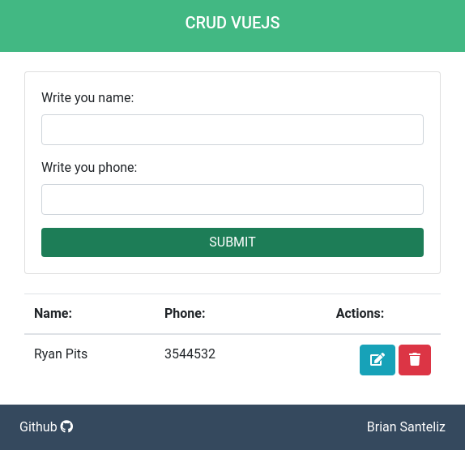
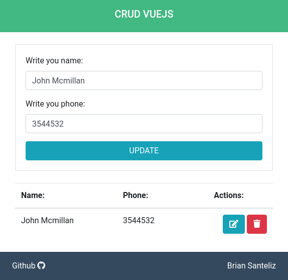
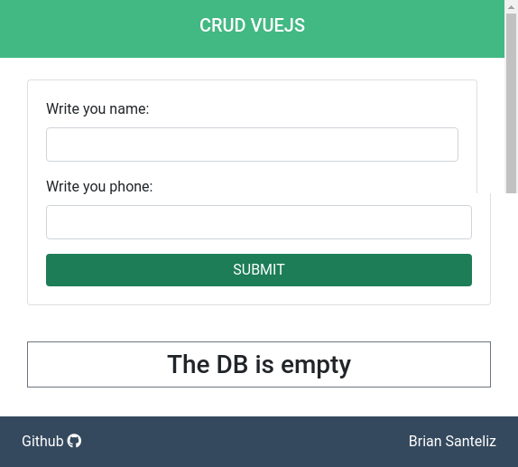

## MEVN STACK CRUD (sql)

CRUD Using:
* Sequelize(mysql)
* Bootstrap
* Axios
* Nodejs
* Express 
* Webpack 
* Vuejs
* Fontawesome

Download a zip or use `git clone`

To install dependencies use:

`npm install`

Compile Webpack:

`npm run build`

Start the server:

`npm start`

---

---

---

